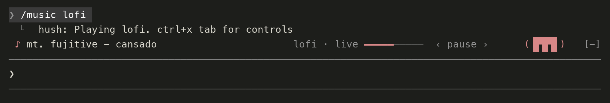
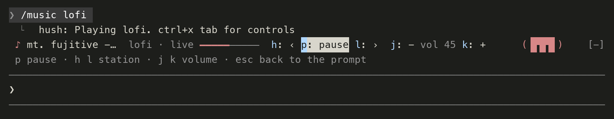

# Hush

Free internet radio and any song, in one quiet line above the Claude Code prompt, with a small DJ Clawd who listens along. When Claude asks you a
question the music steps down, and it comes back when you answer.

- Free: no account, no key. Streams are public stations from the open Radio Browser directory.
- Nothing to install: a small native helper (source in `native/hush.swift`) plays audio with macOS's own `AVPlayer`. It is built on first use with `swiftc`, or downloaded from the GitHub release if Xcode's command line tools are missing.
- macOS only for now. Needs Claude Code 2.1.287 or later.

## Use

    /music            start (or pause and resume)
    /music next       next station (lofi, jazz, chill, classical, nature)
    /music vol 40
    /music stop
    /music frank ocean nights     play any song or artist
    /music clawd                  show or hide DJ Clawd

Press `ctrl+x tab` to focus the band: `p` pause, `h` `l` station, `j` `k` volume, `esc` back.

## Install

    /plugin marketplace add anzal1/hush
    /plugin install hush@hush

or try it for one session with `claude --plugin-dir /path/to/hush`.

A mod runs with your full permissions. Read `hooks/register.mjs` and `native/hush.swift` first; they are short.

## How it works

`hooks/register.mjs` is the mod. It talks to `bin/hush` over a unix socket (`~/.claude/hush/h.sock`).
The helper quits by itself 90 seconds after the last Claude Code session stops talking to it.
If `bin/hush` is missing the mod builds it from `native/hush.swift` with `swiftc`. Rebuild with `./build.sh`.

Ducking listens for `tool.check` (a verdict of "ask") and `AskUserQuestion`, and restores when the tool result
is recorded, the turn ends, or you submit a prompt. Claude Code's built-in guard hides the `classic.*` events from
installed mods, so Hush does not rely on them.

## Stations

Public streams: NIA Radio Lo-Fi, SmoothJazz.com, 0 N Chillout, Radio Swiss Classic, MyNoise Pure Nature.
SomaFM is left out on purpose because its terms prohibit third-party clients.
These are public streams found through the Radio Browser directory. The stations have not agreed to be
in Hush, so use it as you would any radio app, for personal listening. To change the list, edit
`STATIONS` at the top of `hooks/register.mjs`.

## Any song

`/music <song or artist>` finds the song on YouTube and plays it in full, then the next few results.
The first time, Hush downloads [yt-dlp](https://github.com/yt-dlp/yt-dlp) (about 35 MB) into
`~/.claude/hush/`. It updates itself when YouTube changes. Nothing else to install.

Streaming YouTube audio outside YouTube's own player is against YouTube's terms of service. The radio
stations do not use it. Use songs at your own discretion, for personal listening.

## DJ Clawd

A tiny headphone-wearing Clawd sits at the right of the row while music plays. He walks in when a song
starts, nods on tool calls, and lifts one headphone cup when Claude asks you a question (the music steps
down at the same moment). He needs about 84 columns, and `/music clawd` turns him off.

## Updating

Plugins from a GitHub marketplace do not auto-update by default. Turn it on in `/plugin`, on the
**Marketplaces** tab, with **Enable auto-update** on `hush`. Or update by hand:

    claude plugin update hush@hush

then run `/reload-plugins` or restart. Mods need Claude Code 2.1.287 or later; update that with
`claude update`.
